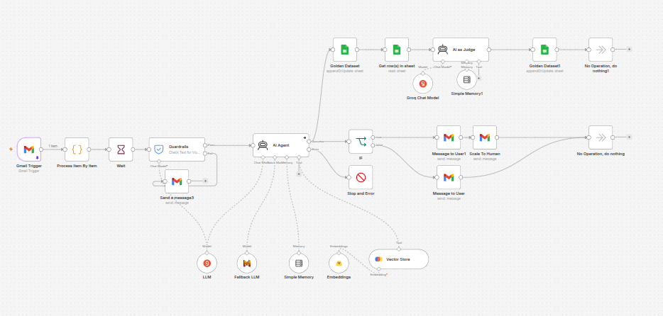

# DOggy Food --- Gmail RAG Customer Support Agent

## Overview

This n8n workflow automates customer support for **DOggy Food**, a
fictional e-commerce brand focused on dog food and pet care products.
Customers send questions through **Gmail**; the workflow applies
guardrails, retrieves relevant information from **ChromaDB**, and uses
**GPT-OSS-120B** to generate concise customer-facing responses. The
system also includes a fallback LLM, conversation memory, human
escalation, a **Golden Dataset**, and an **AI-as-a-Judge** evaluation
path.



------------------------------------------------------------------------

## Business Problem

E-commerce support teams repeatedly answer questions about products,
ingredients, treats, toys, feeding guidance, and general brand
information. Manual handling creates repetitive work, inconsistent
answers, slower response times, and a risk of unsupported claims.

This workflow centralizes customer support around a controlled knowledge
base. Instead of relying only on the LLM's general knowledge, the agent
retrieves relevant DOggy Food information from ChromaDB before
answering. Unknown requests can be escalated to a human.

------------------------------------------------------------------------

## My Role

I designed and implemented the workflow architecture, Gmail integration,
RAG pipeline, ChromaDB retrieval, LLM configuration, guardrails,
fallback handling, conversation memory, human escalation, Golden
Dataset, and AI-based response evaluation.

------------------------------------------------------------------------

## Architecture Summary

``` text
Gmail Trigger
      ↓
Process Email → Wait → Input Guardrails
      │
      ├─ BLOCKED → Security/privacy response → END
      │
      ↓
   AI Agent
      │
      ├─ GPT-OSS-120B
      ├─ Fallback LLM
      ├─ Conversation Memory
      └─ ChromaDB Retriever
              ↓
        Relevant DOggy Food chunks
              ↓
        Generate response
              │
       Human escalation?
       ├─ YES → Customer notification + Internal support notification
       └─ NO  → Gmail response
                  ↓
             Golden Dataset
                  ↓
             AI as Judge
                  ↓
              Score 1–5
                  ↓
             Update dataset
```

------------------------------------------------------------------------

## Trigger

**Node:** `Gmail Trigger`

The workflow polls Gmail every minute and currently filters messages
matching `subject: doggyfood`. The incoming email provides sender,
subject, body, message ID, and thread information.

------------------------------------------------------------------------

## Phase 1 --- Email Processing & Guardrails

**`Process Item By Item`** prepares each Gmail item. **`Wait`** adds a
short delay before processing.

**`Guardrails`** checks incoming content before the AI Agent. Configured
controls include jailbreak detection, PII detection, and keyword-based
filtering.

Blocked requests are routed to **`Send a message3`**, which returns a
security/privacy message instead of sending the content to the main
agent.

------------------------------------------------------------------------

## Phase 2 --- AI Agent

**`AI Agent`** is the core customer-support component. It is instructed
to retrieve information using its ChromaDB tool, answer briefly and
clearly, remain polite, and avoid inventing information.

When the knowledge base does not contain the required information, the
intended behavior is to state that the assistant does not have the
knowledge and is forwarding the request to a human.

### LLM Architecture

**Primary:** `GPT-OSS-120B` through Groq.

**Fallback:** `Ministral 14B` through Mistral Cloud.

The primary model is used for customer-support generation, with the
fallback configured on the AI Agent.

### Conversation Memory

**`Simple Memory`** uses session key `gmailRag` and a context window of
10 messages.

------------------------------------------------------------------------

## Phase 3 --- RAG Retrieval

The AI Agent uses **`Vector Store`** as a ChromaDB retrieval tool.

  Parameter            Value
  -------------------- ------------------------------------------
  Vector database      ChromaDB
  Collection           `doggyfood`
  Retrieval mode       Retrieve as tool
  Top K                5
  Embeddings           `sentence-transformers/all-MiniLM-L6-v2`
  Embedding provider   Hugging Face Inference

The knowledge base contains fictional DOggy Food documentation covering
brand information, products, treats, dental chews, toys, enrichment,
FAQs, and assistant policies.

``` text
Customer email
      ↓
   AI Agent
      ↓
 ChromaDB Tool
      ↓
Top 5 relevant chunks
      ↓
 GPT-OSS-120B
      ↓
Customer response
```

------------------------------------------------------------------------

## Knowledge Base Ingestion

The workflow also contains a separate ingestion branch for Markdown
documents:

``` text
Manual Trigger
      ↓
Search Google Drive
      ↓
Filter `.md` files
      ↓
Download file
      ↓
Default Data Loader
      ↓
Hugging Face Embeddings
      ↓
ChromaDB
```

The Chroma insertion node is configured with **embedding batch size
50**. The ingestion nodes are currently disabled because the knowledge
base can be indexed separately from the runtime email workflow.

------------------------------------------------------------------------

## Phase 4 --- Response Routing

After the AI Agent responds, the workflow checks whether the output
indicates human escalation.

### Normal response

**`Message to User`** replies to the customer through Gmail using the
original sender and a `Re:` subject.

### Human escalation

**`Message to User1`** informs the customer that the request is being
escalated. **`Scale To Human`** sends an internal notification to DOggy
Food support.

This prevents the agent from being forced to answer questions outside
the available knowledge base.

------------------------------------------------------------------------

## Phase 5 --- Golden Dataset

The workflow stores evaluation data in the Google Sheet
**`Gmail Rag Assistance - GoldenDataset`**.

  Field               Purpose
  ------------------- ----------------------------
  `ID`                Gmail message ID
  `Question`          Original customer question
  `Answer`            Generated AI response
  `Expected Answer`   Reference answer
  `Score`             AI-as-Judge score

The generated question and answer are written to the dataset, creating a
persistent record for evaluation.

------------------------------------------------------------------------

## Phase 6 --- AI as Judge

**`AI as Judge`** evaluates the generated answer against the expected
answer. It uses **GPT-OSS-120B through Groq** and returns a score from
**1 to 5** based on response accuracy for an e-commerce customer-support
use case.

``` text
Golden Dataset
      ↓
Get row(s) in sheet
      ↓
AI as Judge
      ↓
Answer vs Expected Answer
      ↓
Score 1–5
      ↓
Golden Dataset1
```

------------------------------------------------------------------------

## RAG Evaluation Strategy

The Golden Dataset should contain several classes of tests:

### Direct retrieval

Questions whose answers clearly exist in one document.

### Semantic retrieval

Questions where the user wording differs from the knowledge-base
wording.

### Multi-document retrieval

Questions requiring information from multiple pieces of the knowledge
base.

### No-answer / hallucination tests

Questions whose answers intentionally do not exist in the knowledge
base. The expected behavior is to escalate rather than invent an answer.

Example:

``` text
How much does DOggy Daily Chicken & Rice cost?
```

If price information is not present, the assistant should not fabricate
a price.

------------------------------------------------------------------------

## Evaluation Decision Tree

``` text
Customer Email
      ↓
Guardrails
      ↓
AI Agent
      ↓
ChromaDB Retrieval
      ↓
Generate Answer
      ↓
Enough knowledge?
   ├─ NO  → Human escalation
   └─ YES → Gmail response
              ↓
         Golden Dataset
              ↓
          AI as Judge
              ↓
           Score 1–5
```

------------------------------------------------------------------------

## External Services & Credentials

  Service                  Purpose
  ------------------------ --------------------------------
  Gmail                    Customer trigger and responses
  Google Drive             Knowledge-base storage
  ChromaDB                 Vector database / retrieval
  Hugging Face Inference   Embeddings
  Groq                     GPT-OSS-120B
  Mistral Cloud            Fallback LLM
  Google Sheets            Golden Dataset and evaluation

------------------------------------------------------------------------

## Error Handling

  Scenario                    Behavior
  --------------------------- ------------------------------------------
  Guardrails reject message   Security/privacy response → stop
  Primary LLM failure         Fallback LLM
  AI Agent failure            `Stop and Error`
  Knowledge unavailable       Agent instructed to escalate
  Human escalation            Customer + internal support notification
  Normal request              Gmail response
  Evaluation                  Store answer and score

------------------------------------------------------------------------

## Main Workflow Components

  Component        Node                     Purpose
  ---------------- ------------------------ -----------------------------------
  Trigger          `Gmail Trigger`          Receive customer emails
  Processing       `Process Item By Item`   Prepare item
  Safety           `Guardrails`             Input protection
  Agent            `AI Agent`               Reasoning and response generation
  Primary model    `LLM`                    GPT-OSS-120B
  Fallback         `Fallback LLM`           Ministral 14B
  Memory           `Simple Memory`          Conversation context
  Retrieval        `Vector Store`           ChromaDB
  Embeddings       `Embeddings`             Vector generation
  Response         `Message to User`        Gmail reply
  Escalation       `Scale To Human`         Human support path
  Dataset          `Golden Dataset`         Store evaluations
  Judge input      `Get row(s) in sheet`    Retrieve expected answer
  Judge            `AI as Judge`            Score response
  Dataset update   `Golden Dataset1`        Persist score
  Error            `Stop and Error`         Failed execution

------------------------------------------------------------------------

## Architecture --- RAG System

``` text
                 KNOWLEDGE INGESTION

Markdown Documents
        ↓
   Google Drive
        ↓
 Default Data Loader
        ↓
 Hugging Face Embeddings
        ↓
      ChromaDB
   `doggyfood`
        │
        │
        ↓
                 RUNTIME

Customer Email
        ↓
    Guardrails
        ↓
    AI Agent
        ↓
  ChromaDB Tool
        ↓
 Top 5 Relevant Chunks
        ↓
  GPT-OSS-120B
        ↓
      Gmail
```

------------------------------------------------------------------------

## Key Design Decisions

### Retrieval over model knowledge

The agent is instructed to use the DOggy Food knowledge base for
brand-specific answers rather than relying only on general model
knowledge.

### Human escalation

Unknown or unsupported requests can be routed to a human instead of
encouraging hallucination.

### Fallback model

A secondary LLM is available when the primary model fails.

### Guardrails before generation

Incoming customer content is checked before it reaches the main agent.

### Evaluation built into the workflow

The Golden Dataset and AI-as-a-Judge make response quality measurable
instead of relying only on manual inspection.

------------------------------------------------------------------------

## Limitations & Future Improvements

-   Add explicit source citations to retrieved chunks.
-   Evaluate retrieval relevance separately from answer correctness.
-   Replace the single 1--5 score with structured metrics such as
    groundedness, factual correctness, completeness, and hallucination.
-   Add latency monitoring.
-   Track token usage and cost.
-   Add automated regression testing against the Golden Dataset.
-   Improve conversation-specific memory and Gmail threading.
-   Add stronger human-escalation classification.
-   Add production observability and execution logging.
-   Add live product/order APIs for questions requiring current customer
    data.

------------------------------------------------------------------------

## Notes

-   The active customer-support path is Gmail-based.
-   The Gmail trigger currently filters messages with
    `subject: doggyfood`.
-   ChromaDB collection: `doggyfood`.
-   Retrieval: `topK = 5`.
-   Embedding batch size: `50`.
-   Embedding model: `sentence-transformers/all-MiniLM-L6-v2`.
-   Primary LLM: GPT-OSS-120B through Groq.
-   Fallback LLM: Ministral 14B through Mistral Cloud.
-   AI-as-a-Judge: GPT-OSS-120B through Groq.
-   Golden Dataset: Google Sheets.
-   Knowledge ingestion is separated from the runtime email-processing
    path.
